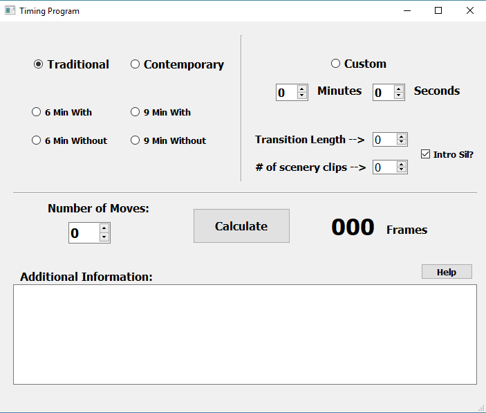

# Timing-Program

This is a small app I made for a previous job at a video production company. It was meant to be used by the video editors working there. It is designed to take in a number of pictures being used, length of video, scenery options the company provided and more customized choices. It output the number of frames needed to import each picture into the video editing application so that the video length matched with pre-cut songs. 

Running Main.py opens the program with GUI. 

Requirements: Python 3.5, PyQt5

